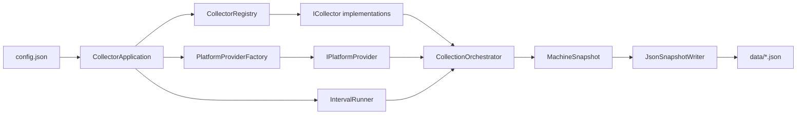

# AI Agent Monitoring Collector

Cross-platform machine telemetry collector. Gathers hardware and network attributes on **Windows**, **macOS**, **Linux**, and **ChromeOS**, writes JSON snapshots on a configurable schedule, and is structured for adding new metrics without rewriting core logic.

## What it collects (initial)

| Collector | Data |
|-----------|------|
| `serial_number` | System serial number |
| `ip_addresses` | Public IP (HTTP lookup) and private IPv4 addresses |
| `mac_addresses` | MAC addresses from active interfaces |
| `hard_drives` | Disk identifiers, model, serial, size, media/interface hints |
| `network_adapters` | Wired and wireless adapters with MAC and link state |

## How it works



1. **Configuration** — `config/config.json` sets the collection interval (minutes), output folder, optional collector allow-list, and public IP lookup URL.
2. **Platform detection** — `PlatformDetector` chooses a provider: Windows, Darwin (macOS), Linux, or ChromeOS (Linux with Chrome-specific serial paths).
3. **Collection cycle** — `CollectionOrchestrator` builds an empty `MachineSnapshot`, then each enabled `ICollector` asks the provider for one category and updates the snapshot.
4. **Persistence** — `JsonSnapshotWriter` writes a timestamped file plus `data/latest.json`.
5. **Scheduling** — `IntervalRunner` repeats the cycle every *N* minutes until stopped, or runs once when `run_once` is true.

### Design principles

- **Single responsibility** — Each class does one job (detect OS, collect serial, write JSON, schedule runs).
- **OOP + interfaces** — `IPlatformProvider` and `ICollector` define contracts; new platforms or metrics are new classes, not edits to a monolith.
- **Extensibility** — Register a new collector in `build_default_registry()` and implement provider methods as needed.

## Quick start

Requires **Python 3.10+** (stdlib only; no virtual environment required).

```bash
# Copy and edit configuration
copy config\config.example.json config\config.json   # Windows
# cp config/config.example.json config/config.json   # macOS / Linux

# Single collection (set "run_once": true in config, or toggle below)
python run.py

# Continuous collection every N minutes
# Set "run_once": false and "collection_interval_minutes": 15
python run.py
```

Or as a module:

```bash
python -m collector
```

### Configuration reference

| Key | Type | Default | Description |
|-----|------|---------|-------------|
| `collection_interval_minutes` | number | `15` | Minutes between collection cycles |
| `output_directory` | string | `data` | Folder for JSON snapshots |
| `enabled_collectors` | array \| null | `null` | If set, only these collector names run |
| `public_ip_lookup_url` | string | ipify JSON URL | Endpoint for public IP |
| `public_ip_timeout_seconds` | number | `5` | HTTP timeout for public IP |
| `run_once` | boolean | `false` | If true, collect once and exit |

Example — collect every 5 minutes, only network-related fields:

```json
{
  "collection_interval_minutes": 5,
  "enabled_collectors": ["ip_addresses", "mac_addresses", "network_adapters"],
  "run_once": false
}
```

## Output format

Each run produces JSON similar to:

```json
{
  "collected_at": "2026-05-25T12:00:00+00:00",
  "platform": "windows",
  "hostname": "WORKSTATION",
  "serial_number": "...",
  "ip_addresses": { "public": "203.0.113.1", "private": ["192.168.1.10"] },
  "mac_addresses": ["aa:bb:cc:dd:ee:ff"],
  "hard_drives": [{ "device_id": "\\\\.\\PHYSICALDRIVE0", "model": "...", "size_bytes": 512110190592 }],
  "network_adapters": [{ "name": "Ethernet", "mac_address": "...", "adapter_type": "wired", "is_up": true }]
}
```

## Project layout

```
collector/
  app.py                 # Composition root
  config/                # Settings loader
  domain/                # MachineSnapshot and value objects
  platform/              # OS detection
  providers/             # Per-OS data access
  collectors/            # One class per metric category
  services/              # Orchestration
  storage/               # JSON writer
  scheduler/             # Interval loop
config/
  config.json            # Active settings (gitignored if you add secrets)
  config.example.json
data/                    # JSON output (gitignored)
.cursor/                 # Cursor rules and project skills
CURSOR.md                # Architecture guide for Cursor agents
AGENTS.md                # Agent entry summary
```

## Platform notes

- **Windows** — Uses PowerShell (`Get-CimInstance`, `Get-NetAdapter`) and `ipconfig` fallbacks.
- **Linux** — Reads `/sys` and `lsblk`; optional `dmidecode` for serial.
- **macOS** — `system_profiler`, `diskutil`, `networksetup` with `/sys`-style fallbacks where applicable.
- **ChromeOS** — Extends Linux provider; tries VPD serial paths first.

Some fields need elevated permissions or optional OS tools (`dmidecode`, `vpd`). Missing data is stored as `null` or empty lists; the collector keeps running.

## Extending

See [CURSOR.md](CURSOR.md) for architecture detail and `.cursor/skills/add-data-collector/SKILL.md` for the step-by-step workflow to add collectors.

## Cursor IDE

- **CURSOR.md** — Structure, conventions, and agent guidance.
- **AGENTS.md** — Short pointer for autonomous agents.
- **`.cursor/rules/`** — Persistent coding conventions.
- **`.cursor/skills/`** — Project skills (e.g. adding a new collector).
